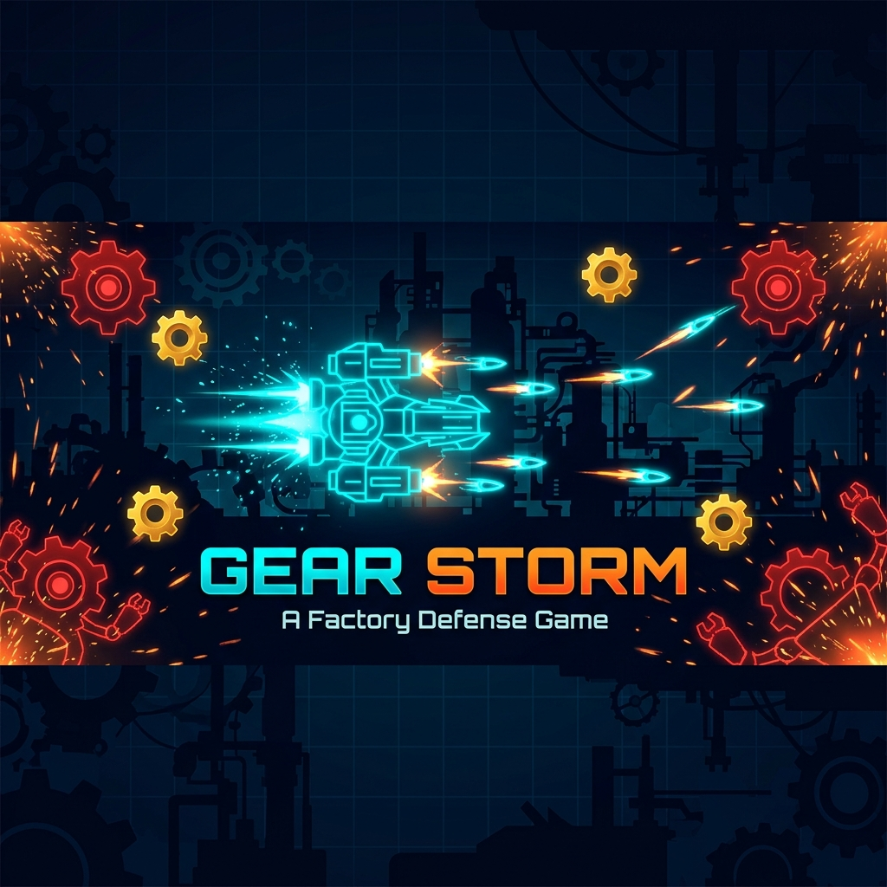
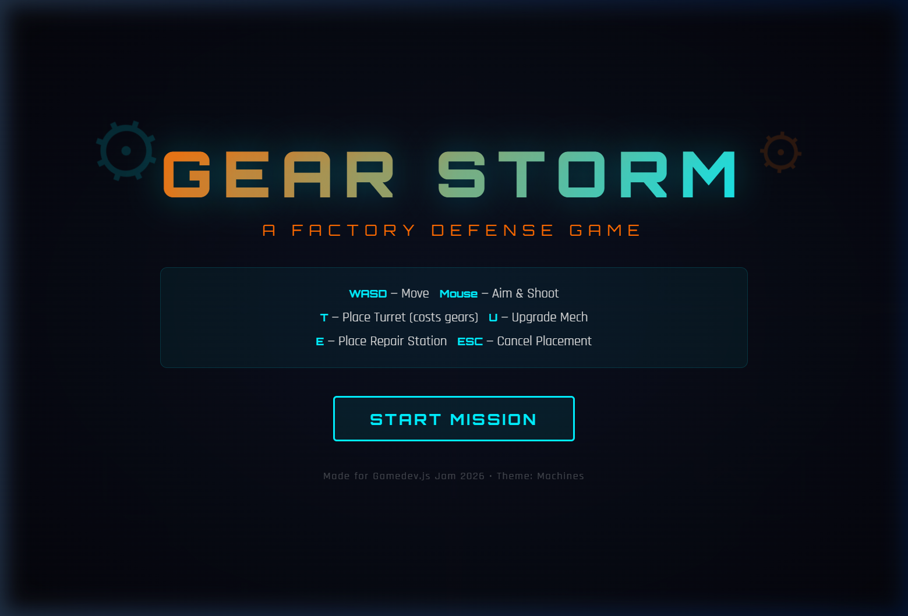
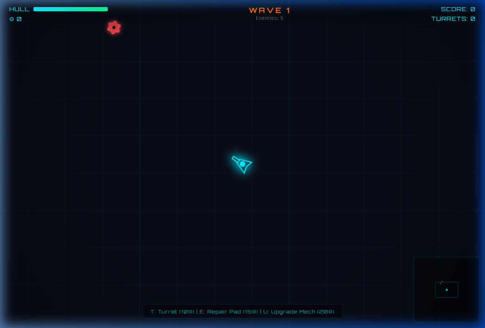
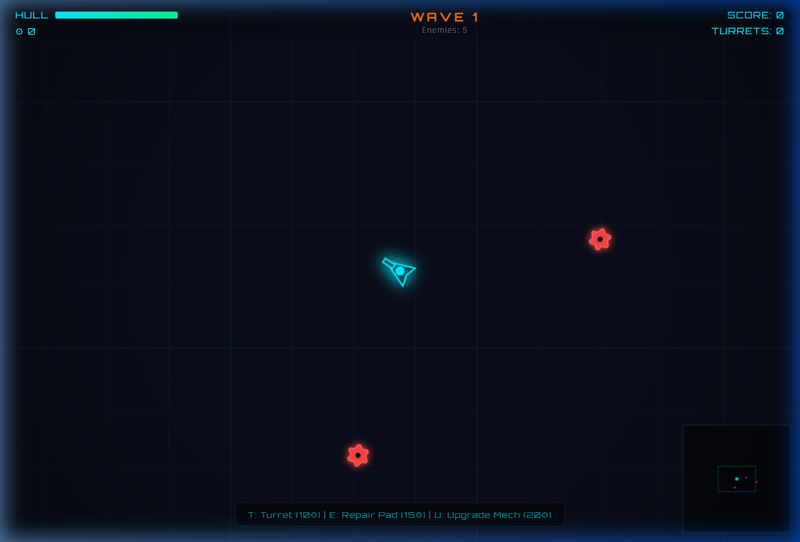

# ⚙ Gear Storm



> **A top-down factory defense game — Pilot your mech, fight rogue machines, collect gears, and build defenses to survive!**

Made for [**Gamedev.js Jam 2026**](https://itch.io/jam/gamedevjs-2026) · Theme: **Machines**

---

## 🎮 Play the Game

Simply open `index.html` in any modern browser — no build tools, no dependencies, no plugins. Just pure HTML5 Canvas + vanilla JavaScript.

```
gear-storm/
├── index.html       → HTML shell with canvas & UI overlays
├── style.css        → Industrial neon UI (Orbitron font, glow effects)
├── game.js          → Complete game engine (~940 lines)
├── screenshots/     → Media assets for this README
└── README.md        → You are here
```

---

## 📸 Screenshots

### Title Screen


### Gameplay
| Wave 1 — First enemies spawning | Combat in action — enemies closing in |
|:---:|:---:|
|  |  |

### 🎬 Gameplay Demo


---

## 🕹️ Controls

| Action | Input |
|--------|-------|
| **Move** | `W` `A` `S` `D` or Arrow Keys |
| **Aim** | Mouse cursor |
| **Shoot** | Left Mouse Button (hold for auto-fire) |
| **Place Turret** | `T` (costs 10⚙) → click to place |
| **Place Repair Pad** | `E` (costs 15⚙) → click to place |
| **Upgrade Mech** | `U` (costs 20⚙) |
| **Cancel Placement** | `Escape` |

---

## 🤖 Enemy Types

| Enemy | Shape | Behavior |
|-------|-------|----------|
| **Drone** | 🔴 Cog | Basic chaser — moves towards you |
| **Speeder** | 🟣 Dart | Fast zigzag movement — hard to hit |
| **Tank** | 🟠 Box | Slow, tanky, shoots projectiles |
| **Boss** | 🔴 Double-cog | Spawns every 5 waves — spread shot, massive HP |

---

## ✨ Features

### Core Gameplay
- **Player mech** with smooth acceleration, mouse aiming & auto-fire
- **Wave-based combat** with progressive difficulty scaling
- **Gear economy** — enemies drop gears used for building & upgrades
- **3 build options**: turrets, repair pads, and mech upgrades

### Buildables
- **Auto-targeting Turrets** — place anywhere on the map; independently target and fire at nearby enemies
- **Repair Pads** — healing zones that regenerate your hull when standing inside
- **Mech Upgrades** — increases damage, speed, fire rate, and max HP per level

### Visual Effects
- Industrial neon aesthetic with glow effects and screen shake
- Particle explosions, bullet trails, and floating damage text
- Animated title screen with spinning cog decorations
- Edge vignette and minimap with real-time entity tracking
- Cog-shaped enemy rendering with procedural drawing

### Audio
- **Procedural sound effects** generated via Web Audio API (no audio files needed)
- Shoot, explosion, pickup, build, hit, wave announce, and game over sounds
- Ambient background beat that pulses during gameplay

### UI / HUD
- Title screen with animated gradient text and control instructions
- In-game HUD: hull bar, gear count, wave number, score, turret count
- Build menu at screen bottom with cost info
- Wave announcements with dramatic flash animation
- Game over summary: waves survived, score, kills, turrets built
- Real-time minimap (bottom‑right) showing player, enemies, turrets, and gears

---

## 🏗️ Technical Details

| Aspect | Detail |
|--------|--------|
| **Engine** | Custom HTML5 Canvas 2D — no frameworks |
| **Language** | Vanilla JavaScript (ES6+ with IIFE encapsulation) |
| **Rendering** | `requestAnimationFrame` game loop with delta-time |
| **World** | 3000×3000 px scrolling world with camera follow |
| **Audio** | Web Audio API oscillator-based procedural SFX |
| **Fonts** | [Orbitron](https://fonts.google.com/specimen/Orbitron) (headings) + [Rajdhani](https://fonts.google.com/specimen/Rajdhani) (body) |
| **Responsive** | Full viewport canvas, mobile-friendly HUD scaling |

### Architecture Highlights
- **Camera system** with smooth lerp follow and world-to-screen coordinate conversion
- **Particle system** supporting multi-color explosions, trails, and floating text
- **Collision detection** via circle-circle intersection
- **Entity pooling** with array splice removal for bullets, enemies, particles, gears, pickups
- **Wave manager** with intermission timers, progressive enemy composition, and boss waves

---

## 🏆 Game Loop

```
Title Screen → START MISSION → Wave 1
                                  ↓
                           Kill all enemies
                                  ↓
                           5s intermission (build defenses!)
                                  ↓
                           Next wave (harder enemies, more spawns)
                                  ↓
                           Every 5th wave → BOSS WAVE ⚠
                                  ↓
                           Hull hits 0 → SYSTEM FAILURE (Game Over)
                                  ↓
                           REBOOT SYSTEM → Back to Wave 1
```

---

## 📦 Jam Submission

This game is ready to submit — just zip the 3 source files and upload to [itch.io](https://itch.io/jam/gamedevjs-2026):

```
gear-storm.zip
├── index.html
├── style.css
└── game.js
```

All assets are procedurally generated (shapes, particles, audio) — no external files required beyond the two Google Fonts loaded via CDN.

---

## 📄 License

Built for the Gamedev.js Jam 2026.
